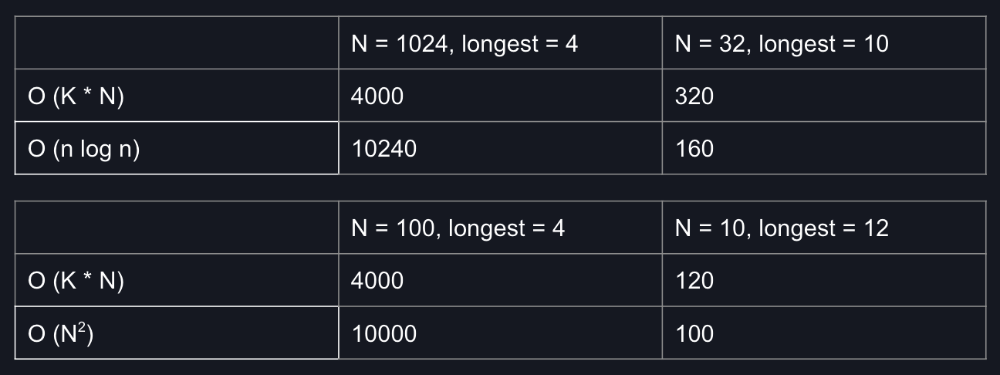

# Radix Sort
### This was created during my time as a [Code Chrysalis](https://codechrysalis.io) Student

Radix sort is a non-comparative integer sorting algorithm. Rather than use comparison between numbers, it exploits the information implied by the length of an integer and its digits.

The term _radix_ represents how many digits are possible in a number system. For example, a binary system has a radix of 2 and a decimal system has a radix of 10.

The time complexity of Radix Sort is O(kN) - where k represents the length of the longest integer.

Radix sort works better than O(N<sup>2</sup>) or O(n log n) algorithms for _large arrays of small numbers_. You can visualize this with the example below:

<p align="center">

</p>

Radix Sort has greater space complexity than in-place sorting algorithms as numbers are sorted into an array for each digit.

### Global Requirements

- node
- yarn

### Installing Dependencies and Set Up

To install dependencies:

```bash
$ yarn
```

To start the server:

```bash
$ yarn serve
```

To start the compilation process:

```bash
$ yarn start
```

You will need to run `yarn serve` and `yarn start` in separate command line windows/tabs.
